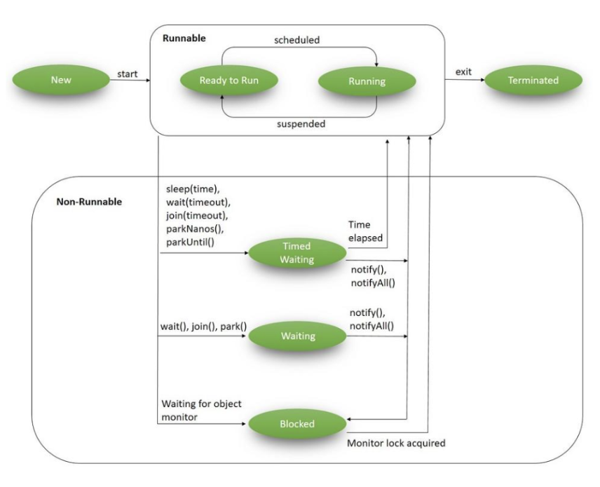
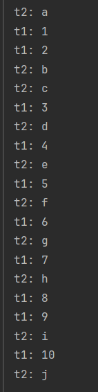
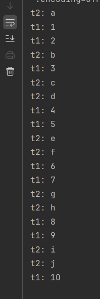
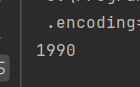
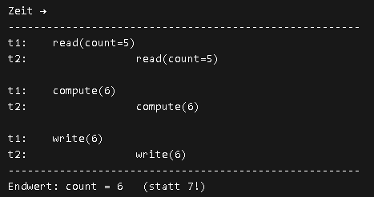
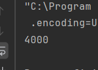
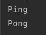

# Nebenläufigkeit

## Grundlagen

### Einführung in Nebenläufigkeit

- Definition: Was ist Nebenläufigkeit? Unterschied zu Parallelität.

     **Nebenläufigkeit** bezieht sich auf die Fähigkeit eines Systems, mehrere Aufgaben ***gleichzeitig*** zu bearbeiten, während **Parallelität** die gleichzeitige Ausführung von Aufgaben auf mehreren Prozessoren oder Kernen bedeutet.

- Warum Nebenläufigkeit?
  - Reaktive Anwendungen - Anwendungen, die auf Ereignisse reagieren, wie z. B. Benutzerinteraktionen oder Netzwerkantworten.
  - Performance‑Optimierung - Durch die Aufteilung von Aufgaben in kleinere Einheiten, die gleichzeitig ausgeführt werden können, können Anwendungen schneller und effizienter arbeiten.
  - Nutzen moderner Mehrkernprozessoren - Moderne Prozessoren verfügen über mehrere Kerne, die gleichzeitig arbeiten können. Nebenläufigkeit ermöglicht es Anwendungen, diese Ressourcen effektiv zu nutzen.
  - Typische Probleme:
    - Race Conditions
   
      Zu diese situation kommt es, wenn mehrere Threads gleichzeitig auf gemeinsame Ressourcen zugreifen und dabei unvorhersehbare Ergebnisse erzeugen können.
         Beispiel: Zwei Threads erhöhen gleichzeitig einen gemeinsamen Zähler, was zu einem inkonsistenten Wert führen kann, wenn die Operation nicht atomar ist.
   
    - Deadlocks
   
       Zu Deadlocks kommt es, wenn zwei oder mehr Threads sich gegenseitig blockieren, indem sie jeweils auf Ressourcen warten, die von anderen Threads gehalten werden.
         Beispiel: Thread A hält Ressource 1 und wartet auf Ressource 2, während Thread B Ressource 2 hält und auf Ressource 1 wartet. Beide Threads können nicht fortfahren, was zu einem Deadlock führt.
   
    - Livelocks
   
       Ein Livelock tritt auf, wenn zwei oder mehr Threads ständig ihre Zustände ändern, um zu versuchen, ein Problem zu lösen, aber dabei nicht vorankommen. 
         Beispiel: Zwei Threads versuchen, eine Ressource zu erwerben, und wenn sie scheitern, geben sie die Ressource frei und versuchen es erneut. 
         Sie könnten sich gegenseitig blockieren, ohne jemals erfolgreich zu sein.
   
    - Sichtbarkeitsprobleme
   
         Sichtbarkeitsprobleme treten auf, wenn Änderungen an gemeinsamen Variablen von einem Thread nicht von anderen Threads gesehen werden, was zu inkonsistentem Verhalten führen kann.
             Beispiel: Ein Thread aktualisiert eine gemeinsame Variable, aber ein anderer Thread sieht diese Änderung nicht und arbeitet mit veralteten Daten.
   
    **wait()** - Ein Thread, der die Methode `wait()` auf einem Objekt aufruft, wird in den Zustand `WAITING` versetzt und wartet darauf, dass ein anderer Thread die Methode `notify()` oder `notifyAll()` auf demselben Objekt aufruft, um ihn zu wecken.
     
    **lock** - Ein Mechanismus, der verwendet wird, um den Zugriff auf gemeinsame Ressourcen zu steuern.
       
    **synchronized** - Ein Schlüsselwort in Java, das verwendet wird, um sicherzustellen, dass nur ein Thread gleichzeitig auf einen bestimmten Abschnitt von Code oder eine Ressource zugreifen kann.
        Es kann auf Methoden oder Blöcke angewendet werden, um kritische Abschnitte zu schützen, die von mehreren Threads gleichzeitig ausgeführt werden könnten.
       
    **voliatile** - Ein Schlüsselwort in Java, das verwendet wird, um sicherzustellen, dass Änderungen an einer Variablen von einem Thread für andere Threads sichtbar sind.
       
    **atomare Operationen** - Operationen, die unteilbar sind, d. h., sie werden entweder vollständig ausgeführt oder überhaupt nicht, ohne dass andere Threads dazwischen eingreifen können.
       
    **ThreadLocal** - Eine Klasse in Java, die es ermöglicht, dass jeder Thread seine eigene unabhängige Kopie einer Variablen hat.
       
    **notifyAll()** - Eine Methode, die verwendet wird, um alle Threads zu wecken, die auf einem bestimmten Objekt warten.
       
    **notify()** - Eine Methode, die verwendet wird, um einen einzelnen Thread zu wecken, der auf einem bestimmten Objekt wartet.
       
    **Thread.sleep()** - Eine Methode, die den aktuellen Thread für eine bestimmte Zeitspanne in den Zustand `TIMED_WAITING` versetzt, bevor er wieder ausführbar wird.
       
    **join()** - Eine Methode, die verwendet wird, um den aktuellen Thread zu blockieren, bis ein anderer Thread seine Ausführung abgeschlossen hat.
       
    **Interrupt** - Ein Mechanismus, mit dem ein Thread signalisiert werden kann, dass er unterbrochen werden soll, z. B. um eine laufende Operation zu stoppen oder um auf ein Ereignis zu reagieren.
   

### The Basics of Java Concurrency

#### Life Cycle of a Thread

- In der Programmiersprache Java wird Multithreading durch das Kernkonzept eines Threads gesteuert.
  Threads durchlaufen während ihres Lebenszyklus verschiedene Zustände.

  

- Die Klasse `java.lang.Thread` enthält ein statisches Enum `State`, das ihre möglichen Zustände definiert.
Zu jedem Zeitpunkt kann sich der Thread nur in einem dieser Zustände befinden:
  
  **NEW** – ein neu erstellter Thread, dessen Ausführung noch nicht begonnen hat, bleibt in diesem Zustand, bis wir es mit der Methode `start()` starten.;

```java
Runnable runnable = new NewState();
Thread t = new Thread(runnable);
System.out.println(t.getState()); 
```

Da wir den erwähnten Thread noch nicht gestartet haben, gibt die Methode `t.getState()` Folgendes aus:
`NEU`

  **RUNNABLE** – Sobald wir einen neuen Thread erstellt und die Methode `start()` aufgerufen haben, wechselt er vom Zustand `NEW` in den Zustand `RUNNABLE`. 
  Threads in diesem Zustand laufen entweder gerade oder sind bereit, ausgeführt zu werden, warten aber auf die Zuweisung von Ressourcen durch das System. 
  In einer Multithread-Umgebung weist der Thread-Scheduler (Teil der JVM) jedem Thread eine feste Laufzeit zu. 
  Er läuft also für eine bestimmte Zeit und gibt dann die Kontrolle an andere Threads im Zustand `RUNNABLE` ab. 
  Fügen wir beispielsweise die Methode `t.start()` zu unserem vorherigen Code hinzu und versuchen wir, auf den aktuellen Zustand zuzugreifen:

```java
Runnable runnable = new NewState();
Thread t = new Thread(runnable);
t.start();
System.out.println(t.getState());
```

Dieser Code gibt höchstwahrscheinlich die Ausgabe `RUNNABLE` zurück.
Es kann sein, dass es vom Thread-Scheduler sofort eingeplant wurde und die Ausführung bereits abgeschlossen ist. 
In solchen Fällen erhalten wir möglicherweise eine andere Ausgabe.

  **BLOCKED** – wartet auf den Erhalt einer Monitorsperre, um einen synchronisierten Block/eine Methode zu betreten oder erneut zu betreten;
  Die Methode `commonResource()` ist **synchronisiert**, d. h., nur ein Thread kann darauf zugreifen. 
  Alle nachfolgenden Threads, die versuchen, auf diese Methode zuzugreifen, werden blockiert, bis der aktuelle Thread die Verarbeitung abgeschlossen hat.

```java
public class BlockedState {
   public static void main(String[] args) throws
           InterruptedException {
      Thread t1 = new Thread(new DemoBlockedRunnable());
      Thread t2 = new Thread(new DemoBlockedRunnable());
      t1.start();
      t2.start();
      Thread.sleep(1000);
      System.out.println(t2.getState());
      System.exit(0);
   }
}

public static synchronized void commonResource() {
while(true) {
// Infinite loop to mimic heavy processing
// ‘t1’ won’t leave this method
// when ‘t2’ tries to enter this
}
}
```

Wenn t1 diese Methode aufruft, befindet es sich in einer Endlosschleife; dies dient lediglich dazu,
eine rechenintensive Verarbeitung zu simulieren, damit keine anderen Threads diese Methode aufrufen können.
Wenn wir nun t2 starten, versucht es, die Methode `commonResource()` aufzurufen,
die bereits von t1 verwendet wird; daher verbleibt t2 im Zustand `BLOCKED`.
Wenn wir in diesem Zustand `t2.getState()` aufrufen, erhalten wir die Ausgabe:
`BLOCKED`

  **WAITING** – wartet darauf, dass ein anderer Thread eine bestimmte Aktion ausführt (ohne Zeitlimit), z. B. durch Aufrufen von `wait()`, `join()` oder `park()`. Beachten Sie, dass wir in wait() und join() keine Timeout-Periode definieren.;
  **TIMED_WAITING** – wartet darauf, dass ein anderer Thread eine bestimmte Aktion für einen festgelegten Zeitraum ausführt, z. B. durch Aufrufen von `sleep()`, `wait()` mit einem Timeout oder `join()` mit einem Timeout.;
  **TERMINATED** – hat seine Ausführung beendet oder wurde abnormal beendet.

#### How to Start a Thread in Java

- Es gibt zwei Möglichkeiten, einen Thread in Java zu starten:
  1. Durch Erstellen einer Klasse, die das `Runnable`-Interface implementiert und die `run()`-Methode überschreibt.
  2. Durch Erstellen einer Klasse, die die `Thread`-Klasse erweitert und die `run()`-Methode überschreibt, Dies ist weit entfernt von produktionsreifem Code, 
  wo es entscheidend ist, Ressourcen korrekt zu verwalten, um häufige Kontextwechsel oder übermäßigen Speicherverbrauch zu vermeiden. 
  Um produktionsreif zu werden, müssen wir nun zusätzlichen Code schreiben, um Folgendes zu berücksichtigen:
     • die konsistente Erstellung neuer Threads
     • die Anzahl gleichzeitig aktiver Threads
     • die Freigabe von Threads – besonders wichtig für Daemon-Threads, um Speicherlecks zu vermeiden. 
  Wir könnten unseren Code für all diese Fälle schreiben, wenn wir wollten.
  3. Durch die Verwendung von **Lambda-Ausdrücken** (ab Java 8) für eine einfachere und prägnantere Syntax.
  4. Durch die Verwendung von **ExecutorService**, das eine höhere Abstraktionsebene für die Verwaltung von Threads bietet, 
     Der ExecutorService implementiert das Thread-Pool-Entwurfsmuster (auch Replizierter-Worker- oder Worker-Crew-Modell genannt) und übernimmt die
     oben erwähnte Thread-Verwaltung. Zusätzlich bietet er einige sehr nützliche Funktionen wie Thread-Wiederverwendbarkeit und Aufgabenwarteschlangen.
     Insbesondere die Thread-Wiederverwendbarkeit ist sehr wichtig. In einer großen Anwendung verursacht die Zuweisung und Freigabe vieler Thread-Objekte einen
     erheblichen Speicherverwaltungsaufwand.
     Mit Worker-Threads minimieren wir den durch die Thread-Erstellung verursachten Aufwand.
     Um die Pool-Konfiguration zu vereinfachen, verfügt der ExecutorService über einen einfachen Konstruktor und einige Anpassungsoptionen, wie z. B. den Warteschlangentyp, die
     minimale und maximale Anzahl von Threads und deren Namenskonvention.
  
- Beispiel für die erste Methode:

***Runnable-Interface***

```java
class MyRunnable implements Runnable {
   @Override
   public void run() {
      System.out.println("Runnable läuft in: " + Thread.currentThread().getName());
   }
}

public class RunnableExample {
   public static void main(String[] args) {
      Thread t = new Thread(new MyRunnable());
      t.start();
   }
}
```

***Extend Thread***

```java
class MyThread extends Thread {
    @Override
    public void run() {
        System.out.println("Thread läuft: " + getName());
    }
}

public class Main {
    public static void main(String[] args) {
        MyThread t = new MyThread();
        t.start();
    }
}
```

***Lambda-Ausdrücke***

```java
public class Main {
   public static void main(String[] args) {
      Thread t = new Thread(() -> {
         System.out.println("Lambda Thread: " + Thread.currentThread().getName());
      });
      t.start();
   }
}
```

***ExecutorService***

```java
import java.util.concurrent.ExecutorService;
import java.util.concurrent.Executors;

public class Main {
    public static void main(String[] args) {
        ExecutorService executor = Executors.newFixedThreadPool(2);

        executor.submit(() -> {
            System.out.println("Executor Thread: " + Thread.currentThread().getName());
        });

        executor.shutdown();
    }
}
```

- Ausführung verzögerter oder periodischer Aufgaben
  Bei der Arbeit mit komplexen Webanwendungen müssen wir möglicherweise Aufgaben zu bestimmten Zeiten oder sogar regelmäßig ausführen.
  Java bietet einige Werkzeuge, die uns bei der Ausführung verzögerter oder wiederkehrender Operationen helfen:

• java.util.Timer
• java.util.concurrent.ScheduledThreadPoolExecutor

  - **Timer**: Ein Timer ermöglicht es uns, eine Aufgabe zu einem bestimmten Zeitpunkt oder nach einer bestimmten Verzögerung auszuführen oder wiederholte Ausführung in
    regelmäßigen Abständen.
    Er verwendet einen Hintergrund-Thread, um die geplanten Aufgaben auszuführen. 
    Wir können eine Aufgabe planen, indem wir die Methode `schedule()` aufrufen und die gewünschte Verzögerung oder den gewünschten Zeitpunkt angeben.

```java - DELAY
TimerTask task = new TimerTask() {
public void run() {
    System.out.println(“Task performed on: “ + new Date() +“n”+ “Thread’s name: “ + Thread.currentThread().getName());
    }
};
Timer timer = new Timer(“Timer”);
long delay = 1000L;
timer.schedule(task, delay);
```

```java - REPEAT
timer.scheduleAtFixedRate(repeatedTask, delay, period);
```

  - **ScheduledThreadPoolExecutor**: Eine Alternative zum Timer ist der ScheduledThreadPoolExecutor, der eine flexiblere und robustere Möglichkeit bietet, geplante Aufgaben auszuführen. 
    Er ist Teil des java.util.concurrent-Pakets und bietet Funktionen wie die Möglichkeit, mehrere Threads zu verwenden, um geplante Aufgaben auszuführen, und die Fähigkeit, geplante Aufgaben zu stornieren.
    Wenn der Prozessor die Bearbeitung der Aufgabe nicht rechtzeitig vor dem nächsten Auftreten abschließen kann, wartet der ScheduledExecutorService, bis die aktuelle Aufgabe abgeschlossen ist, bevor er die nächste startet.
    Um diese Wartezeit zu vermeiden, können wir `scheduleWithFixedDelay()` verwenden, das, wie der Name schon sagt, eine Verzögerung fester Länge zwischen den Iterationen der Aufgabe garantiert.

**Timer:**
• Bietet keine Echtzeitgarantie; plant Aufgaben mithilfe der Methode `Object.(long)`.
• Es gibt einen einzigen Hintergrundthread, daher werden Aufgaben sequenziell ausgeführt, und eine langlaufende Aufgabe kann andere verzögern.
• Laufzeitausnahmen, die in einem TimerTask ausgelöst werden, beenden den einzigen verfügbaren Thread und damit den Timer.
**ScheduledThreadPoolExecutor:**
• Kann mit einer beliebigen Anzahl von Threads konfiguriert werden.
• Kann alle verfügbaren CPU-Kerne nutzen.
• Fängt Laufzeitausnahmen ab und ermöglicht deren Behandlung (durch Überschreiben der Methode `afterExecute` von `ThreadPoolExecutor`).
• Bricht die Aufgabe ab, die die Ausnahme ausgelöst hat, während andere Aufgaben weiterlaufen.
• Nutzt das Planungssystem des Betriebssystems, um Zeitzonen, Verzögerungen, Sonnenzeit usw. zu berücksichtigen.
• Bietet eine kollaborative API für die Koordination mehrerer Aufgaben, z. B. zum Warten auf den Abschluss aller übermittelten Aufgaben.
• Bietet eine verbesserte API für die Verwaltung des Thread-Lebenszyklus.

#### wait() und notify()

In einer Multithread-Umgebung können mehrere Threads versuchen, dieselbe Ressource zu verändern. Eine fehlerhafte Thread-Verwaltung führt zu Inkonsistenzen.

Ein Werkzeug zur Koordination der Aktionen mehrerer Threads in Java sind geschützte Blöcke. Diese Blöcke prüfen eine bestimmte Bedingung, bevor die Ausführung fortgesetzt wird.
Daher verwenden wir Folgendes:
• `Object.()` zum Anhalten eines Threads
• `Object.notify()` zum Aufwecken eines Threads
Das folgende Diagramm veranschaulicht den Lebenszyklus eines Threads:
Bitte beachten Sie, dass es viele Möglichkeiten gibt, diesen Lebenszyklus zu steuern. In diesem Artikel konzentrieren wir uns jedoch nur auf `wait()` und `notify()`.

***wait()***: Ein Thread, der die Methode `wait()` auf einem Objekt aufruft, wird in den Zustand `WAITING` versetzt und wartet darauf, dass ein anderer Thread die Methode `notify()` oder `notifyAll()` auf demselben Objekt aufruft, um ihn zu wecken.
Dafür muss der aktuelle Thread den Monitor des Objekts besitzen. Laut Javadocs kann dies auf folgende Weise geschehen:
• wenn die synchronisierte Instanzmethode für das jeweilige Objekt ausgeführt wurde
• wenn der Rumpf eines synchronisierten Blocks für das jeweilige Objekt ausgeführt wurde
• durch die Ausführung synchronisierter statischer Methoden für Objekte vom Typ `Class`.
Beachten Sie, dass immer nur ein aktiver Thread den Monitor eines Objekts besitzen kann.
Die `wait()`-Methode verfügt über drei überladene Signaturen. Schauen wir uns diese genauer an.

*wait(long timeout)* – wartet bis zum Ablauf der angegebenen Zeit oder bis ein anderer Thread die Methode `notify()` oder `notifyAll()` auf demselben Objekt aufruft, um ihn zu wecken.

*wait(long timeout, int nanos)* – wartet bis zum Ablauf der angegebenen Zeit oder bis ein anderer Thread die Methode `notify()` oder `notifyAll()` auf demselben Objekt aufruft, um ihn zu wecken. Die Zeitangabe erfolgt in Millisekunden und Nanosekunden.

```java
public static sinchtonized ping(){
while(!condition) {
    obj.wait();
   notifyAll();
}
}
```

In diesem Beispiel wird der Thread in einer Schleife angehalten, bis die Bedingung erfüllt ist. Sobald die Bedingung erfüllt ist, wird der Thread durch einen Aufruf von `notify()` oder `notifyAll()` geweckt.   
notify() – weckt einen einzelnen Thread, der auf einem bestimmten Objekt wartet. Wenn mehrere Threads auf demselben Objekt warten, wird einer von ihnen zufällig ausgewählt und geweckt.
notifyAll() – weckt alle Threads, die auf einem bestimmten Objekt warten. Alle geweckten Threads konkurrieren dann um die CPU, und einer von ihnen wird fortfahren, während die anderen wieder in den Zustand `WAITING` zurückkehren, wenn sie die CPU nicht erhalten.  

### Grundlagen

***Übung 3.1***

- Implementiere zwei Threads: Einer zählt von 1–10 („Zähler‑Thread“), der Hauptthread zählt von A–J („Buchstaben‑Thread“). Nutze `sleep(500)` in beiden und `join()` am Ende, um auf Beendigung zu warten

```java
package uebung_3;

import java.util.ArrayList;
import java.util.List;

public class Zaehlen {
    public static void main(String[] args) throws InterruptedException {
        List buchstaben = new ArrayList();
        buchstaben.add("a");
        buchstaben.add("b");
        buchstaben.add("c");
        buchstaben.add("d");
        buchstaben.add("e");
        buchstaben.add("f");
        buchstaben.add("g");
        buchstaben.add("h");
        buchstaben.add("i");
        buchstaben.add("j");
        Thread t1 = new Thread(() ->{
            for(int i=1; i <=10;i++){
                System.out.println("t1: " + i);
                try{
                    Thread.sleep(500);
                } catch (InterruptedException e) {
                    throw new RuntimeException(e);
                }
            }
        });
        Thread t2 = new Thread(() ->{
           for(int i=0; i <10;i++){
               System.out.println("t2: " + buchstaben.get(i));
               try{
                   Thread.sleep(500);
               } catch (InterruptedException e) {
                   throw new RuntimeException(e);
               }
           }
        });
        t1.start();
        t2.start();
        t1.join();
        t2.join();
    }
}
```



Hier passiert Folgendes: Beide Threads werden gestartet und führen ihre jeweiligen Schleifen aus. Da beide Threads `sleep(500)` verwenden, wechseln sie sich ungefähr alle 500 Millisekunden ab, um ihre Ausgaben zu drucken. Am Ende warten wir mit `join()` auf die Beendigung beider Threads, bevor das Hauptprogramm fortfährt.
Und können wir die Ausgabe sehen, die sowohl die Zahlen von 1 bis 10 als auch die Buchstaben von A bis J enthält, aber hier entscheidet sceduler wer drann ist.
Deshalb könnte die Ausgabe in verschiedenen Reihenfolgen erscheinen, abhängig von der Thread-Planung durch die JVM.

```java
package uebung_3;

import java.util.ArrayList;
import java.util.List;

public class Zaehlen {
    public static void main(String[] args) throws InterruptedException {
        List<String> buchstaben = new ArrayList<>();
        buchstaben.add("a");
        buchstaben.add("b");
        buchstaben.add("c");
        buchstaben.add("d");
        buchstaben.add("e");
        buchstaben.add("f");
        buchstaben.add("g");
        buchstaben.add("h");
        buchstaben.add("i");
        buchstaben.add("j");

        Thread t1 = new Thread(() -> {
            for (int i = 1; i <= 10; i++) {
                System.out.println("t1: " + i);
                Thread.yield(); // gibt anderen Threads die Chance
                try {
                    Thread.sleep(500);
                } catch (InterruptedException e) {
                    throw new RuntimeException(e);
                }
            }
        });

        Thread t2 = new Thread(() -> {
            for (int i = 0; i < 10; i++) {
                System.out.println("t2: " + buchstaben.get(i));
                Thread.yield(); // gibt anderen Threads die Chance
                try {
                    Thread.sleep(500);
                } catch (InterruptedException e) {
                    throw new RuntimeException(e);
                }
            }
        });

        // Priorität setzen
        t1.setPriority(Thread.MAX_PRIORITY);
        t2.setPriority(Thread.MIN_PRIORITY);

        t1.start();
        t2.start();
        t1.join();
        t2.join();
    }
}
```



Ausgabe sagt uns dass trotzt der Priorität und ``yield()`` beide Threads ungefähr gleich oft ausgeführt werden, was zeigt, dass die Thread-Planung in Java nicht strikt auf Prioritäten basiert und dass `yield()` keine Garantie dafür gibt, dass andere Threads sofort ausgeführt werden.
Oder dass sich schön abwechseln, was zeigt, dass die Thread-Planung in Java nicht strikt auf Prioritäten basiert und dass `yield()` keine Garantiedafür.

***Übung 3.2***

- Erweitere die vorherige Zähler‑Thread‑Aufgabe um einen gemeinsamen `static int count = 0`. Lass beide Threads `count++` 1000x ausführen und `System.out.println(count)` am Ende. Warum ist die Ausgabe oft < 2000?

```java
package uebung_3;

public class Count {
    static int count = 0;

    public static void main(String[] args) throws InterruptedException {

        Thread t1 = new Thread(() -> {
            for (int i = 0; i < 1000; i++) {
                count++;
            }
        });

        Thread t2 = new Thread(() -> {
            for (int i = 0; i < 1000; i++) {
                count++;
            }
        });

        t1.start();
        t2.start();
        t1.join();
        t2.join();

        System.out.println(count);
    }
}
```


Die Ausgabe ist oft weniger als 2000, weil die Operation `count++` nicht atomar ist. 
Sie besteht aus mehreren Schritten: Lesen des aktuellen Werts von `count`, 
Inkrementieren des Werts und Schreiben des neuen Werts zurück in `count`. 
Wenn zwei Threads gleichzeitig `count++` ausführen, 
können sie beide den gleichen Wert von `count` lesen, 
bevor einer von ihnen den neuen Wert zurückschreibt. 
Dies führt zu einem sogenannten "Race Condition", 
bei dem die endgültige Ausgabe von der genauen Reihenfolge der 
Thread-Ausführung abhängt. In einigen Fällen kann dies dazu führen, 
dass einige Inkrementierungen verloren gehen, was zu einer Ausgabe von weniger als 2000 führt.

- Zeichne ein Diagramm der Thread‑Interleaving, das den Fehler zeigt.



### Synchronisation

***Übung 4.1***

- Mache den vorherigen Zähler thread‑sicher mit `synchronized`-Blöcken (Lock auf `this` oder `Counter.class`). Teste mit 4 Threads parallel; der finale `count` muss immer 4000 sein.

```java
package uebung_4;

public class SynchCount {
    static int count = 0;

    public static void main(String[] args) throws InterruptedException {

        Runnable task = () -> {
            for (int i = 0; i < 1000; i++) {
                synchronized (SynchCount.class) {
                    count++;
                }
            }
        };

        Thread t1 = new Thread(task);
        Thread t2 = new Thread(task);
        Thread t3 = new Thread(task);
        Thread t4 = new Thread(task);

        t1.start();
        t2.start();
        t3.start();
        t4.start();

        t1.join();
        t2.join();
        t3.join();
        t4.join();

        System.out.println(count); // immer 4000
    }
}
```



***Übung 4.2***

- Implementiere einen einfachen Ping‑Pong‑Zähler: Zwei Threads wechseln sich ab (Thread1: „Ping“, Thread2: „Pong“), mit `wait()`/`notify()` in einem synchronisierten Block. Starte mit 10 Runden.

```java
package uebung_4;

public class PingPong {

    private static final Object lock = new Object();
    private static boolean pingTurn = true; // Ping beginnt

    public static void main(String[] args) throws InterruptedException {

        Thread ping = new Thread(() -> {
            for (int i = 0; i < 10; i++) {
                synchronized (lock) {
                    while (!pingTurn) {
                        try {
                            lock.wait();
                        } catch (InterruptedException e) {
                            throw new RuntimeException(e);
                        }
                    }
                    System.out.println("Ping");
                    pingTurn = false;
                    lock.notifyAll();
                }
            }
        });

        Thread pong = new Thread(() -> {
            for (int i = 0; i < 10; i++) {
                synchronized (lock) {
                    while (pingTurn) {
                        try {
                            lock.wait();
                        } catch (InterruptedException e) {
                            throw new RuntimeException(e);
                        }
                    }
                    System.out.println("Pong");
                    pingTurn = true;
                    lock.notifyAll();
                }
            }
        });

        ping.start();
        pong.start();

        ping.join();
        pong.join();
    }
}
```



- Was passiert mit `notify()` statt `notifyAll()`? Teste und erkläre.


Mit nut 2 Threads in diesem Beispiel, `notify()` und `notifyAll()` haben den gleichen Effekt, da es nur einen Thread gibt, der auf das Lock wartet.
Wenn wir jedoch mehr als 2 Threads haben, könnte `notify()` einen falschen Thread wecken, der nicht derjenige ist, der gerade an der Reihe ist, was zu einem Deadlock führen könnte, wenn der geweckte Thread auf das gleiche Lock wartet. 
`notifyAll()` hingegen weckt alle wartenden Threads, und derjenige, der an der Reihe ist, wird fortfahren, während die anderen wieder in den Zustand `WAITING` zurückkehren, wenn sie die CPU nicht erhalten. 
Daher ist `notifyAll()` sicherer, wenn mehrere Threads auf dasselbe Lock warten, da es das Risiko von Deadlocks reduziert.

## Fortgeschritten Anwendungen

***Lock API***

Ein synchronisierter Block ist vollständig in einer Methode enthalten. Wir können die Sperr-APIs `lock()` und `unlock()` in separaten Methoden ausführen.
Ein synchronisierter Block unterstützt die Fairness nicht. Jeder Thread kann die Sperre erhalten, sobald sie aufgehoben wurde, und es kann keine Präferenz angegeben werden. Wir können Fairness innerhalb der Lock-APIs erreichen, indem wir die Fairness-Eigenschaft angeben. Dadurch wird sichergestellt, dass der am längsten wartende Thread Zugriff auf die Sperre erhält.
Ein Thread wird blockiert, wenn er keinen Zugriff auf den synchronisierten Block erhält. Die Lock-API bietet die Methode `tryLock()`. Der Thread erhält nur dann eine Sperre, wenn sie verfügbar ist und nicht von einem anderen Thread gehalten wird. Dies reduziert die Blockierungszeit des Threads, der auf die Sperre wartet.
Ein Thread, der sich im Status *„Warten“* auf den Zugriff auf den synchronisierten Block befindet, kann nicht unterbrochen werden. Die Lock-API bietet eine Methode `lockInterruptably()`, mit der der Thread unterbrochen werden kann, wenn er auf die Sperre wartet.

**void lock()** – Erwerben Sie die Sperre, wenn sie verfügbar ist. Wenn die Sperre nicht verfügbar ist, wird ein Thread blockiert, bis die Sperre aufgehoben wird.
**void lockInterruptably()** – Dies ähnelt lock(), ermöglicht jedoch die Unterbrechung des blockierten Threads und die Wiederaufnahme der Ausführung durch eine ausgelöste java.lang.InterruptedException.
**boolean tryLock()** – Dies ist eine nicht blockierende Version der lock()-Methode. Es wird versucht, die Sperre sofort zu erhalten und gibt true zurück, wenn die Sperre erfolgreich ist.
**boolean tryLock(long timeout, TimeUnit timeUnit)** – Dies ähnelt tryLock(), außer dass es das angegebene Timeout abwartet, bevor es den Versuch aufgibt, die Sperre zu erhalten.
**void unlock()** entsperrt die Lock-Instanz.
Eine gesperrte Instanz sollte immer entsperrt werden, um einen Deadlock-Zustand zu vermeiden.
Ein empfohlener Codeblock zur Verwendung der Sperre sollte einen Try/Catch- und einen Final-Block enthalten:

#### ReentrantLock

Die ReentrantLock-Klasse implementiert die Lock-Schnittstelle. Es bietet die gleiche Parallelität und Speichersemantik wie die implizite Monitorsperre, auf die über synchronisierte Methoden und Anweisungen zugegriffen wird, mit erweiterten Funktionen.

```java
import java.util.concurrent.locks.ReentrantLock;

public class SharedObjectWithLock {
    //...
    ReentrantLock lock = new ReentrantLock();
    int counter = 0;

    public void perform() {
        lock.lock();
        try {
            // Critical section here
            count++;
        } finally {
            lock.unlock();
        }
    }
    //...
}
```

Wir müssen sicherstellen, dass wir die `lock()` - und `unlock()`-Aufrufe in den ***try-finally-Block*** einschließen, um Deadlock-Situationen zu vermeiden.

```java
public void performTryLock(){
    //...
    boolean isLockAcquired = lock.tryLock(1, TimeUnit.SECONDS);
    
    if(isLockAcquired) {
        try {
            //Critical section here
        } finally {
            lock.unlock();
        }
    }
    //...
}

```

In diesem Fall wartet der Thread, der `tryLock()` aufruft, eine Sekunde und gibt das Warten auf, wenn die Sperre nicht verfügbar ist.

#### ReadWriteLock

Lesesperre – Wenn kein Thread die Schreibsperre erworben oder angefordert hat, können mehrere Threads die Lesesperre erwerben.
Schreibsperre – Wenn keine Threads lesen oder schreiben, kann nur ein Thread die Schreibsperre erhalten.

```java
public class SynchronizedHashMapWithReadWriteLock {

    Map<String,String> syncHashMap = new HashMap<>();
    ReadWriteLock lock = new ReentrantReadWriteLock();
    // ...
    Lock writeLock = lock.writeLock();

    public void put(String key, String value) {
        try {
            writeLock.lock();
            syncHashMap.put(key, value);
        } finally {
            writeLock.unlock();
        }
    }
    ...
    public String remove(String key){
        try {
            writeLock.lock();
            return syncHashMap.remove(key);
        } finally {
            writeLock.unlock();
        }
    }
    //...
}
```

Für beide Schreibmethoden müssen wir den kritischen Abschnitt mit der Schreibsperre umgeben – nur ein Thread kann darauf zugreifen:

```java
Lock readLock = lock.readLock();
//...
public String get(String key){
    try {
        readLock.lock();
        return syncHashMap.get(key);
    } finally {
        readLock.unlock();
    }
}

public boolean containsKey(String key) {
    try {
        readLock.lock();
        return syncHashMap.containsKey(key);
    } finally {
        readLock.unlock();
    }
}
```
Für beide Lesemethoden müssen wir den kritischen Abschnitt mit der Lesesperre umgeben. Mehrere Threads können auf diesen Abschnitt zugreifen, wenn kein Schreibvorgang ausgeführt wird.,

#### Condition

Die Condition-Klasse bietet einem Thread die Möglichkeit, auf das Eintreten einer Bedingung zu warten, während er den kritischen Abschnitt ausführt.
Dies kann auftreten, wenn ein Thread Zugriff auf den kritischen Abschnitt erhält, aber nicht über die erforderliche Bedingung zum Ausführen seiner Operation verfügt. Beispielsweise kann ein Lesethread Zugriff auf die Sperre einer gemeinsam genutzten Warteschlange erhalten, die noch keine Daten zum Verarbeiten hat.
Traditionell stellt Java die Methoden `wait()`, `notify()` und `notifyAll()` für die Thread-Interkommunikation bereit.
Bedingungen haben ähnliche Mechanismen, wir können jedoch auch mehrere Bedingungen angeben:

```java
public class ReentrantLockWithCondition {

    Stack<String> stack = new Stack<>();
    int CAPACITY = 5;

    ReentrantLock lock = new ReentrantLock();
    Condition stackEmptyCondition = lock.newCondition();
    Condition stackFullCondition = lock.newCondition();

    public void pushToStack(String item){
        try {
            lock.lock();
            while(stack.size() == CAPACITY) {
                stackFullCondition.await();
            }
            stack.push(item);
            stackEmptyCondition.signalAll();
        } finally {
            lock.unlock();
        }
    }

    public String popFromStack() {
        try {
            lock.lock();
            while(stack.size() == 0) {
                stackEmptyCondition.await();
            }
            return stack.pop();
        } finally {
            stackFullCondition.signalAll();
            lock.unlock();
        }
    }
}
```

####  Executor, ExecutorService und Executors
**Executor** ist die zentrale übergeordnete Schnittstelle im Parallelitäts-Framework von Java, die die Aufgabenübermittlung von der Ausführungsmechanik entkoppelt und über ihre Methode *„execute()“* nur ausführbare Aufgaben akzeptiert, ohne Ergebnisse zurückzugeben. **ExecutorService** erweitert Executor um erweiterte Funktionen, einschließlich der Methode *„submit()“*, die sowohl ausführbare als auch aufrufbare Aufgaben akzeptiert und ein Future-Objekt zum Verfolgen asynchroner Ergebnisse zurückgibt, sowie Methoden zur Verwaltung der Poolbeendigung wie *„shutdown()“* und *„shutdownNow()“*.
Die Executors-Klasse fungiert als Dienstprogrammfabrik, die statische Methoden zum Erstellen verschiedener vorkonfigurierter **ExecutorService-Implementierungen** bereitstellt, wie z. B. *newFixedThreadPool()*, *newCachedThreadPool()*, *newSingleThreadExecutor()* und *newScheduledThreadPool()*, wodurch die Erstellung von Thread-Pools ohne manuelle Konfiguration vereinfacht wird.
Zu den wichtigsten Unterschieden zwischen diesen Komponenten gehören:

***Hierarchie***: Executor ist die Basisschnittstelle, ExecutorService ist die Unterschnittstelle, die Executor erweitert, und Executors ist die konkrete Dienstprogrammklasse.
***Aufgabenbehandlung***: Executor.execute() verarbeitet nur Runnable und gibt void zurück, während ExecutorService.submit() sowohl Runnable als auch Callable verarbeitet und eine Zukunft zurückgibt.
***Verwaltung***: ExecutorService bietet Beendigungskontrollen (Herunterfahren, WaitTermination) und Ergebnisabruf, Funktionen, die in der grundlegenden Executor-Schnittstelle fehlen.
***Erstellung***: Entwickler instanziieren ExecutorService-Implementierungen normalerweise über Executors-Factory-Methoden, anstatt sie direkt zu erstellen.

```java
ExecutorService executor = Executors.newFixedThreadPool(10);
```
Beispielsweise erstellt die folgende Codezeile einen Thread-Pool mit 10 Threads.

Die **execute()** Methode ist Leere und bietet keine Möglichkeit, das Ergebnis der Ausführung einer Aufgabe abzurufen oder den Status der Aufgabe zu überprüfen (wird sie ausgeführt):
```java
executorService.execute(runnableTask);
```
Die **submit()** Methode akzeptiert sowohl Runnable- als auch Callable-Aufgaben und gibt ein Future-Objekt zurück, mit dem wir den Status der Aufgabe überprüfen und das Ergebnis abrufen können:
```java
Future<?> future = executorService.submit(runnableTask);
```
Die **invokeAll()** Methode akzeptiert eine Sammlung von Callable-Aufgaben, führt sie aus und gibt eine Liste von Future-Objekten zurück, die die Ergebnisse der Aufgaben repräsentieren:
```java
List<Callable<String>> tasks = Arrays.asList(callableTask1, callableTask2);
List<Future<String>> futures = executorService.invokeAll(tasks);
```
Die **invokeAny()** Methode akzeptiert eine Sammlung von Callable-Aufgaben, führt sie aus und gibt das Ergebnis der ersten erfolgreich abgeschlossenen Aufgabe zurück:
```java
List<Callable<String>> tasks = Arrays.asList(callableTask1, callableTask2);
String result = executorService.invokeAny(tasks);
```
Die **shutdown()** Methode führt nicht zur sofortigen Zerstörung der ExecutorService. Es wird die ExecutorService Hören Sie auf, neue Aufgaben anzunehmen, und fahren Sie herunter, nachdem alle laufenden Threads ihre aktuelle Arbeit beendet haben:
```java
List<Runnable> notExecutedTasks = executorService.shutdown();
```

Die **shutdownNow()** Methode versucht, die zu zerstören ExecutorService sofort, aber es garantiert nicht, dass alle laufenden Threads gleichzeitig gestoppt werden:
```java
List<Runnable> notExecutedTasks = executorService.shutdownNow();
```

#### Runnable vs Callable

Die Runnable-Schnittstelle (im Paket java.lang) definiert eine Aufgabe mit der Methode ***run()***, die keinen Rückgabewert hat und keine geprüften Ausnahmen (checked exceptions) werfen kann; sie kann direkt mit Thread oder ExecutorService ausgeführt werden.  Im Gegensatz dazu bietet die Callable-Schnittstelle (im Paket java.util.concurrent) die Methode ***call()***, die einen Wert des Typs `V` zurückgibt und geprüfte Ausnahmen propagieren kann; Callable-Aufgaben können jedoch nur über ExecutorService (nicht direkt über den Thread-Konstruktor) ausgeführt werden und liefern ein Future-Objekt zur Ergebnismeldung.

Hauptunterschiede im Überblick:
*Rückgabewert*: run() ist void und liefert kein Ergebnis, während call() einen generischen Typ zurückgibt.
*Ausnahmen*: run() muss geprüfte Ausnahmen intern abfangen, call() darf sie werfen.
*Ausführung*: Runnable wird mit new Thread(runnable).start() oder execute() genutzt, Callable erfordert submit() und Future.get().
*Paket*: Runnable stammt aus java.lang, Callable aus java.util.concurrent.
Beide Schnittstellen sind funktionale Schnittstellen mit einer einzelnen abstrakten Methode und können in Lambda-Ausdrücken (Java 8+) verwendet werden, um Aufgaben asynchron auszuführen.

```java
public interface Runnable {
    void run();
}

public interface Callable<V> {
    V call() throws Exception;
}

```

#### Future und CompletableFuture

Die **Future-Schnittstelle**, die 2005 in Java 5 eingeführt wurde, dient als schreibgeschützter Container für das Ergebnis einer asynchronen Berechnung, bietet jedoch keine Methoden, um Berechnungen zu kombinieren oder Fehler zu behandeln.  Im Gegensatz dazu ist **CompletableFuture** (seit Java 8), das sowohl *Future* als auch *CompletionStage* *implementiert*, ein Framework mit über 50 Methoden, das die ***Verkettung, Kombination und Fehlerbehandlung asynchroner Schritte ermöglicht***.
Während Future-Objekte primär über die `get()`-Methode abgerufen werden und Ausnahmen manuell behandelt werden müssen, erlaubt CompletableFuture den Einsatz von Lambda-Ausdrücken und Methodenketten für komplexere Workflows.  Typische Anwendungsfälle für CompletableFuture umfassen:

**Asynchrone Ausführung**: Nutzung von supplyAsync() für ergebnisproduzierende Aufgaben oder runAsync() für Aufgaben ohne Rückgabewert.
**Verarbeitungsketten**: Transformation von Ergebnissen mit thenApply(), Konsumieren mit thenAccept() oder Abarbeiten nach Abschluss mit whenComplete().
**Kombination und Synchronisation**: Warten auf mehrere Aufgaben mit allOf() oder Ausführen der ersten fertigen Aufgabe mit anyOf().
**Fehlerbehandlung**: Abfangen von Ausnahmen direkt in der Kette mittels exceptionally() oder handle().
CompletableFuture fungiert somit als erweiterte Zukunftsversion der Future, die asynchrone Programmierung durch funktionale Verkettung und integrierte Fehlermechanismen deutlich effizienter und lesbarer macht. 

- Erstelle einen `ExecutorService` mit 3 Threads (`Executors.newFixedThreadPool(3)`). Sende 10 `Runnable`-Aufgaben (z.B. „Aufgabe X läuft“), die `sleep(1000)` machen. Schließe den Pool mit `shutdown()`.

```java
package uebung_5;

import java.util.concurrent.ExecutorService;
import java.util.concurrent.Executors;

public class ExecutoRunnable {
    public static void main(String[] args) {
        ExecutorService executor = Executors.newFixedThreadPool(3);

        Runnable task = () -> {
            try {
                System.out.println("Aufgabe läuft in: " + Thread.currentThread().getName());
                Thread.sleep(1000);
            } catch (InterruptedException e) {
                Thread.currentThread().interrupt();
            }
        };

        // 10 Aufgaben senden
        for (int i = 0; i < 10; i++) {
            executor.execute(task);
        }

        executor.shutdown();
    }
}
```

- Ersetze `Runnable` durch `Callable<Integer>` (berechnet Zufallszahl), hole mit `Future` die Ergebnisse und summiere sie.

```java

package uebung_5;

import java.util.ArrayList;
import java.util.List;
import java.util.Random;
import java.util.concurrent.*;

public class ExecutorCallable {
    public static void main(String[] args) {
        ExecutorService executor = Executors.newFixedThreadPool(3);

        List<Future<Integer>> futures = new ArrayList<>();
        Random random = new Random();

        // 10 Callable-Tasks erstellen und absenden
        for (int i = 1; i <= 10; i++) {
            Callable<Integer> task = () -> {
                int zahl = random.nextInt(100); // Zufallszahl 0–99
                System.out.println("Berechnet: " + zahl + " in " + Thread.currentThread().getName());
                Thread.sleep(1000);
                return zahl;
            };

            futures.add(executor.submit(task)); // submit statt execute!
        }

        // Ergebnisse holen und aufsummieren
        int summe = 0;

        for (Future<Integer> future : futures) {
            try {
                summe += future.get(); // wartet auf Ergebnis
            } catch (InterruptedException e) {
                Thread.currentThread().interrupt();
            } catch (ExecutionException e) {
                e.printStackTrace();
            }
        }

        System.out.println("Gesamtsumme: " + summe);

        executor.shutdown();
    }
}
```